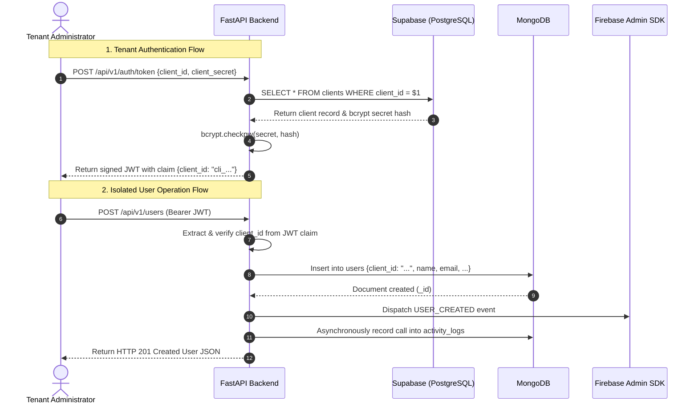

# Database Architecture & Rationale (Supabase + MongoDB)

This document addresses the requirements outlined in **Section 5 (Database Requirements)** of the technical assignment.

---

## 1. Why Both Databases Were Selected

A dual-database polyglot persistence architecture was selected to separate **relational entity governance** from **high-velocity, flexible tenant application data**:

1. **Supabase (PostgreSQL)** is optimal for **Tenant Onboarding & Authentication Credentials**:
   - Client identity requires strict relational integrity, ACID compliance, and relational constraints (e.g., unique `client_id`, non-null bcrypt hashes).
   - Relational schemas prevent corruption of credentials and support enterprise auditing.

2. **MongoDB** is optimal for **Tenant User Records & Request Activity Logs**:
   - User profiles in modern platforms frequently evolve with custom tenant metadata, arbitrary JSON attributes, and varying organizational roles without schema migration overhead.
   - Activity logging is a write-heavy, append-only workload that benefits from document indexing on timestamps and tenant IDs without lock contention.

---

## 2. What Data Is Stored in Each Database

### A. Supabase (PostgreSQL) — Table: `clients`
Stores tenant registration and credential hashes:
- `id` (UUID): Primary key.
- `client_id` (TEXT, UNIQUE): Public unique identifier for the tenant (e.g., `cli_...`).
- `client_secret_hash` (TEXT): One-way bcrypt hash of the secret key (10 rounds). Raw secrets are never stored.
- `name` (TEXT): Registered organization name.
- `email` (TEXT, NULLABLE): Administrator contact email.
- `created_at` (TIMESTAMP WITH TIME ZONE): Tenant provisioning timestamp.
- `is_active` (BOOLEAN): Soft-kill switch to disable a compromised or expired client.

### B. MongoDB — Collection: `users`
Stores all tenant-managed user entities with hard tenant isolation:
- `_id` (ObjectId): Document identifier.
- `client_id` (String): Partitioning key for strict tenant isolation (indexed).
- `name` (String): User's full name.
- `email` (String): User email (unique per tenant).
- `role` (String): Role classification (`admin`, `member`, `viewer`).
- `status` (String): Account status (`active`, `pending`, `inactive`).
- `metadata` (Object): Dynamic key-value store for tenant-specific attributes.
- `is_deleted` (Boolean): Soft-delete flag.
- `created_at` (Date/String): Creation timestamp.
- `updated_at` (Date/String): Last modification timestamp.

### C. MongoDB — Collection: `activity_logs`
Stores the complete audit trail of incoming API traffic:
- `_id` (ObjectId): Document identifier.
- `client_id` (String): Tenant identifier (indexed).
- `endpoint` (String): Requested URI path (e.g., `/api/v1/users`).
- `method` (String): HTTP verb (`GET`, `POST`, `PUT`, `DELETE`).
- `status` (Integer): Final response status code (e.g., 200, 201, 401, 404).
- `duration_ms` (Float): Latency measured in milliseconds.
- `ip` (String): Remote client IP address.
- `timestamp` (Date/String): ISO 8601 execution timestamp (indexed descending).

---

## 3. Advantages & Disadvantages of Each Database

| Database | Advantages | Disadvantages |
| :--- | :--- | :--- |
| **Supabase (PostgreSQL)** | • Strict schema validation prevents invalid credential states. • Strong ACID guarantees for sensitive identity records. • Built-in row-level security (RLS) and cryptographic extensions (`pgcrypto`). | • Rigid table schema requires formal migrations when adding fields. • Higher connection overhead compared to connection-pooled document stores. |
| **MongoDB** | • Dynamic schema easily accommodates tenant-specific metadata. • Extremely high write throughput for append-only audit logging. • Native JSON querying with rich operators (`$regex`, `$or`, compound indexes). | • Does not enforce relational constraints across collections. • Requires application-level query scoping (`client_id`) to ensure tenant isolation. |

---

## 4. How the Application Interacts with Both Databases

